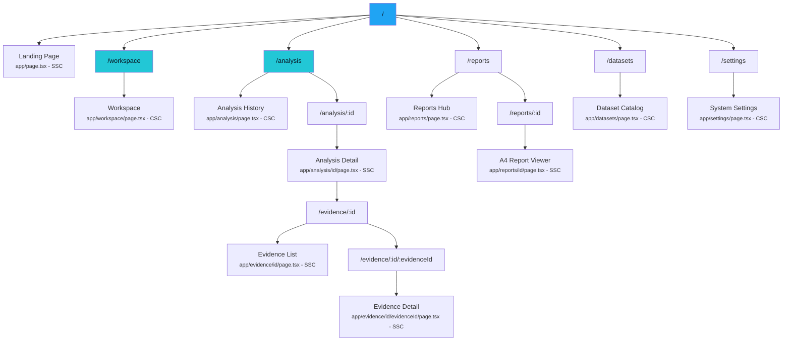
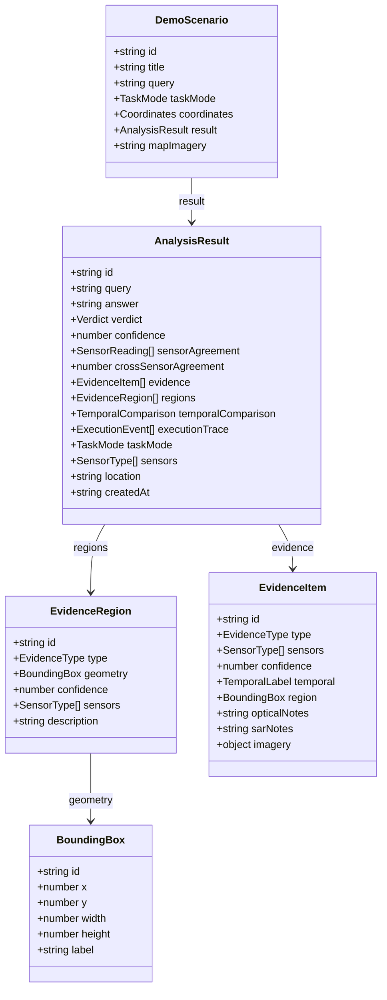
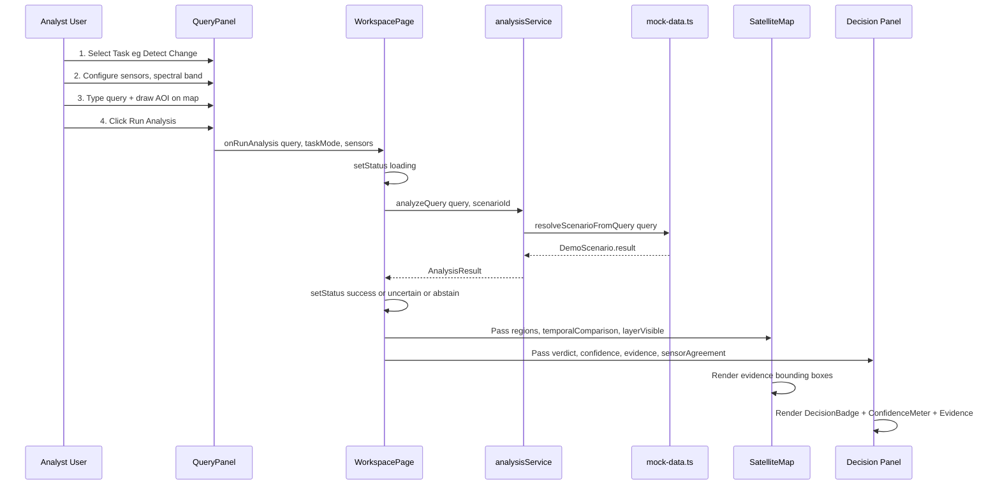
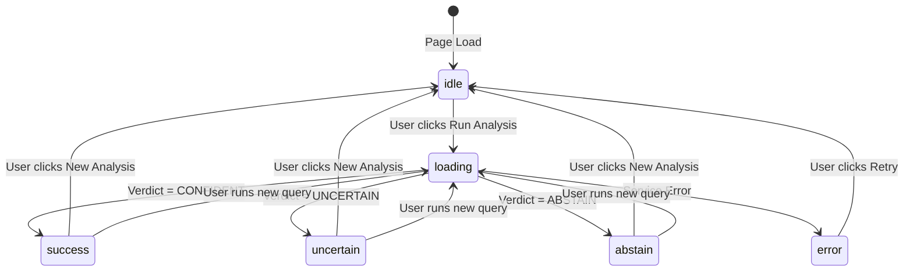
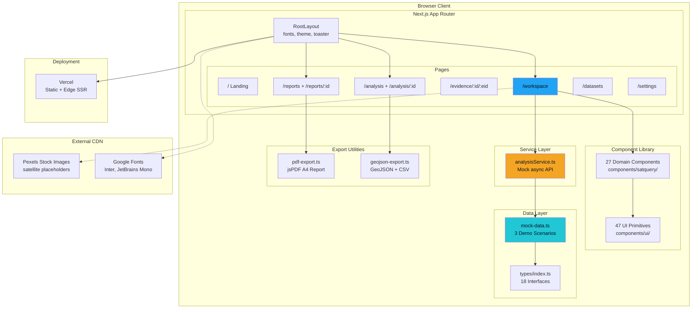

# SATQUERY AI — Architecture Document

> **Version:** 2.4 (Static Frontend)  
> **Framework:** Next.js 13.5 (App Router)  
> **Total Source Lines:** ~12,300 (excluding `node_modules`, `.next`, configs)  
> **Deployment:** Vercel (Static/SSR hybrid)

---

## 1. Project Overview

**SatQuery AI** is an evidence-first satellite decision intelligence console. It allows geospatial analysts to query satellite imagery using natural language prompts and receive structured, uncertainty-aware verdicts backed by spatially grounded evidence.

The current build is a **fully static frontend** — all analysis results, sensor readings, and evidence data are generated from in-memory mock data. There is **no backend, no database, and no real ML inference pipeline**. The architecture is designed so that the mock data layer can be swapped with real API calls without touching any UI components.

### Core Concept: Evidence-First Intelligence

```
┌─────────────────────────────────────────────────────────┐
│                    ANALYST QUERY                        │
│              "Has urban growth occurred?"                │
└────────────────────┬────────────────────────────────────┘
                     ▼
┌─────────────────────────────────────────────────────────┐
│              TASK CLASSIFICATION                        │
│     VQA │ CHANGE │ GROUND │ COMPARE                     │
└────────────────────┬────────────────────────────────────┘
                     ▼
┌─────────────────────────────────────────────────────────┐
│           MULTI-SENSOR ANALYSIS (Mock)                  │
│   Optical Spectral ←→ SAR Coherence ←→ Temporal Diff   │
└────────────────────┬────────────────────────────────────┘
                     ▼
┌─────────────────────────────────────────────────────────┐
│            EVIDENCE GROUNDING + FUSION                  │
│   Bounding Boxes → Sensor Agreement → Calibration       │
└────────────────────┬────────────────────────────────────┘
                     ▼
┌─────────────────────────────────────────────────────────┐
│          VERDICT: CONFIDENT │ UNCERTAIN │ ABSTAIN       │
│         + Calibrated Confidence Score (0–100%)          │
└─────────────────────────────────────────────────────────┘
```

---

## 2. Tech Stack

| Layer | Technology | Purpose |
|:---|:---|:---|
| **Framework** | Next.js 13.5.1 (App Router) | File-based routing, SSR/SSG, React Server Components |
| **Language** | TypeScript 5.2 | Type safety across entire codebase |
| **UI Library** | React 18.2 | Component rendering, state management |
| **Styling** | Tailwind CSS 3.3 + `tailwindcss-animate` | Utility-first CSS, animation classes |
| **UI Primitives** | Radix UI (via shadcn/ui) | Accessible headless components (Dialog, Tabs, Select, etc.) |
| **Icons** | Lucide React | Consistent icon set (~40 icons used) |
| **Notifications** | Sonner | Toast notification system |
| **Theming** | next-themes | Dark mode provider (forced dark) |
| **PDF Export** | jsPDF | Client-side A4 report generation |
| **CSS Utilities** | clsx + tailwind-merge (via `cn()`) | Conditional class merging |
| **Fonts** | Inter (sans) + JetBrains Mono (mono) | Via `next/font/google` |

---

## 3. Directory Structure

```
SATQUERY-AI/
├── app/                          # Next.js App Router (pages + layouts)
│   ├── layout.tsx                # Root layout: fonts, theme, toaster
│   ├── page.tsx                  # Landing page (/)
│   ├── globals.css               # Global CSS + Tailwind directives
│   ├── workspace/
│   │   └── page.tsx              # Main analysis workspace (/workspace)
│   ├── analysis/
│   │   ├── page.tsx              # Analysis history list (/analysis)
│   │   └── [id]/
│   │       └── page.tsx          # Analysis detail view (/analysis/:id)
│   ├── evidence/
│   │   └── [id]/
│   │       ├── page.tsx          # Evidence list for analysis (/evidence/:id)
│   │       └── [evidenceId]/
│   │           └── page.tsx      # Single evidence detail (/evidence/:id/:evidenceId)
│   ├── reports/
│   │   ├── page.tsx              # Reports hub (/reports)
│   │   └── [id]/
│   │       └── page.tsx          # Full A4 report viewer (/reports/:id)
│   ├── datasets/
│   │   └── page.tsx              # Dataset catalog (/datasets)
│   └── settings/
│       └── page.tsx              # System configuration (/settings)
│
├── components/
│   ├── satquery/                 # Domain-specific components (27 files)
│   │   ├── TopNav.tsx            # Global navigation bar
│   │   ├── QueryPanel.tsx        # Task selection + query input + run (706 LOC)
│   │   ├── SatelliteMap.tsx      # Map viewport with AOI + evidence overlays (499 LOC)
│   │   ├── A4ReportViewer.tsx    # Full A4 paginated report renderer (951 LOC)
│   │   ├── ChatFollowUp.tsx      # Post-analysis conversational Q&A (233 LOC)
│   │   ├── GuidedDemoModal.tsx   # 5-step pitch tour modal (262 LOC)
│   │   ├── DecisionBadge.tsx     # CONFIDENT / UNCERTAIN / ABSTAIN badge
│   │   ├── ConfidenceMeter.tsx   # Calibrated confidence gauge (0–100%)
│   │   ├── SensorAgreement.tsx   # Optical vs SAR agreement bars
│   │   ├── ExecutionTrace.tsx    # Pipeline event log viewer
│   │   ├── EvidenceCard.tsx      # Evidence region summary card
│   │   ├── AbstentionCard.tsx    # ABSTAIN verdict explanation panel
│   │   ├── UncertaintyCard.tsx   # UNCERTAIN verdict explanation panel
│   │   ├── Timeline.tsx          # T1 ↔ T2 temporal comparison slider
│   │   ├── LayerControl.tsx      # Map layer visibility toggles
│   │   ├── MapToolbar.tsx        # Zoom, coordinate display, AOI tools
│   │   ├── ComparisonViewer.tsx  # Side-by-side image comparison
│   │   ├── EmptyState.tsx        # Workspace empty/onboarding state
│   │   ├── LoadingState.tsx      # Analysis-in-progress animation
│   │   ├── ErrorState.tsx        # Error fallback display
│   │   ├── VerdictSummary.tsx    # Compact verdict + confidence line
│   │   ├── AnalysisMapSection.tsx# Map wrapper for analysis detail pages
│   │   ├── PageHeader.tsx        # Reusable page title component
│   │   ├── ReportPreview.tsx     # Report thumbnail placeholder
│   │   ├── ThemeProvider.tsx     # next-themes wrapper (forced dark)
│   │   ├── ThemeToggle.tsx       # Theme switcher (inactive — always dark)
│   │   └── AppToaster.tsx        # Sonner toaster mount point
│   │
│   └── ui/                       # shadcn/ui primitives (47 files)
│       ├── button.tsx, dialog.tsx, tabs.tsx, select.tsx, ...
│       └── (Radix-based headless components with Tailwind styling)
│
├── lib/                          # Utilities and data generation
│   ├── mock-data.ts              # All 3 demo scenarios + report builder (381 LOC)
│   ├── pdf-export.ts             # jsPDF A4 report generator (813 LOC)
│   ├── geojson-export.ts         # GeoJSON + CSV export utilities (130 LOC)
│   └── utils.ts                  # cn() helper (clsx + twMerge)
│
├── services/                     # Service abstraction layer
│   ├── analysisService.ts        # Mock async API (delay + scenario lookup)
│   ├── evidenceService.ts        # Placeholder (1 LOC)
│   └── reportService.ts          # Placeholder (1 LOC)
│
├── types/
│   └── index.ts                  # All TypeScript interfaces (181 LOC)
│
├── hooks/
│   └── use-toast.ts              # Toast state management hook
│
├── tailwind.config.ts            # Design tokens + brand color palette
├── next.config.js                # Next.js config (ESLint bypass, unoptimized images)
├── tsconfig.json                 # TypeScript config with path aliases
├── postcss.config.js             # PostCSS for Tailwind
└── package.json                  # Dependencies and scripts
```

---

## 4. Routing Map

All routes use the Next.js 13 App Router (`app/` directory convention).



> **SSC** = Server Component (default) · **CSC** = Client Component (`'use client'`)

---

## 5. Component Hierarchy

### 5.1 Workspace — Primary View

The workspace is the core interaction surface. It uses a **three-panel layout**:

```
┌──────────────────────────────────────────────────────────────┐
│                         TopNav                               │
│  [Logo] [Workspace] [Datasets] [Analysis] [Reports] [⚙️] [👤]│
├──────────┬───────────────────────────────┬───────────────────┤
│          │                               │                   │
│  Query   │      SatelliteMap             │    Decision       │
│  Panel   │                               │    Panel          │
│  (Left)  │   ┌───────────────────┐       │                   │
│          │   │  Satellite Image  │       │   DecisionBadge   │
│ TaskGrid │   │  + AOI Rectangle  │       │   ConfidenceMeter │
│ 2×2 Cards│   │  + Evidence Boxes │       │   SensorAgreement │
│          │   └───────────────────┘       │   ExecutionTrace  │
│ Config   │   MapToolbar (floating)       │   EvidenceCards   │
│ Panel    │   LayerControl (floating)     │   ChatFollowUp    │
│          │   Timeline (floating)         │   Timeline        │
│ QueryBox │                               │                   │
│ RunButton│                               │                   │
│          │                               │                   │
└──────────┴───────────────────────────────┴───────────────────┘
     360px        flex-1 (remaining)              420px
```

### 5.2 Component Dependency Tree

```mermaid
graph TD
    subgraph "App Shell"
        LAYOUT["RootLayout"]
        TOPNAV["TopNav"]
        TOASTER["AppToaster"]
        THEME["ThemeProvider"]
    end

    subgraph "Workspace Page - CSC"
        WP["WorkspaceContent"]
        QP["QueryPanel"]
        SM["SatelliteMap"]
        DP["Decision Panel - inline"]
    end

    subgraph "Query Panel Components"
        QP --> TASKGRID["Task Grid 2x2"]
        QP --> TASKCONFIG["Task Config Panel"]
        QP --> QUERYINPUT["Query Textarea"]
        QP --> RUNBTN["Run Analysis Button"]
    end

    subgraph "Map Components"
        SM --> MT["MapToolbar"]
        SM --> LC["LayerControl"]
        SM --> TL["Timeline"]
        SM --> AOI["AOI Drawing"]
        SM --> EVBOX["Evidence Bounding Boxes"]
    end

    subgraph "Decision Panel Components"
        DP --> DB["DecisionBadge"]
        DP --> CM["ConfidenceMeter"]
        DP --> SA["SensorAgreement"]
        DP --> ET["ExecutionTrace"]
        DP --> EC["EvidenceCard"]
        DP --> UC["UncertaintyCard"]
        DP --> AC["AbstentionCard"]
        DP --> CF["ChatFollowUp"]
    end

    subgraph "State Flow Components"
        WP --> ES["EmptyState"]
        WP --> LS["LoadingState"]
        WP --> ERS["ErrorState"]
    end

    LAYOUT --> THEME --> WP
    LAYOUT --> TOASTER
    WP --> TOPNAV
    WP --> QP
    WP --> SM
    WP --> DP

    style WP fill:#20A4F3,color:#07111F
    style QP fill:#22C7D6,color:#07111F
    style SM fill:#22C7D6,color:#07111F
    style DP fill:#22C7D6,color:#07111F
```



---

## 6. Type System

All domain types are defined in a single file: [`types/index.ts`](file:///Users/atharvashah/Downloads/SATQUERY-AI/types/index.ts)

### Core Types



### Enums and Union Types

| Type | Values | Usage |
|:---|:---|:---|
| `Verdict` | `CONFIDENT` · `UNCERTAIN` · `ABSTAIN` | AI decision output |
| `TaskMode` | `VQA` · `CHANGE` · `GROUND` · `COMPARE` | Analysis task type |
| `SensorType` | `OPTICAL` · `SAR` · `TEMPORAL` | Data source classification |
| `LayerKey` | `OPTICAL` · `SAR` · `CHANGE` · `GROUNDING` · `EVIDENCE` | Map layer toggles |
| `AnalysisStatus` | `idle` · `loading` · `success` · `uncertain` · `abstain` · `error` | Workspace FSM states |
| `EvidenceType` | `Structural change` · `New structure` · `Land-cover change` · `Flood extent` · `Vegetation loss` · `Grounded object` | Evidence classification |

---

## 7. Data Flow

### 7.1 Analysis Execution Flow

The entire data pipeline runs client-side with simulated async delays:



### 7.2 Service Abstraction Layer

The [`services/`](file:///Users/atharvashah/Downloads/SATQUERY-AI/services) directory provides an **async interface** that currently wraps mock data but is designed to be swapped with real HTTP calls:

```typescript
// services/analysisService.ts — Current (Mock) Implementation

analyzeQuery(query, scenarioId?)    →  delay(100ms) → resolveScenarioFromQuery()
getAnalysis(id)                     →  delay(200ms) → findScenario(id)?.result
listAnalyses()                      →  delay(150ms) → demoScenarios.map(s → s.result)
getDemoScenario(id)                 →  delay(150ms) → findScenario(id)
getEvidence(analysisId, evidenceId) →  delay(200ms) → find evidence in result
getReport(analysisId)               →  delay(250ms) → buildReport(analysis)
```

> **To connect a real backend**, only this service file needs to change — replace `delay()` + mock lookups with `fetch()` calls. All components consume the same `AnalysisResult` type.

### 7.3 Mock Data Architecture

[`lib/mock-data.ts`](file:///Users/atharvashah/Downloads/SATQUERY-AI/lib/mock-data.ts) (381 LOC) contains **3 pre-built demo scenarios**:

| Scenario ID | Title | Verdict | Confidence | Task Mode |
|:---|:---|:---|:---|:---|
| `urban-growth-gurugram` | Urban Expansion Detection | `CONFIDENT` | 92% | `CHANGE` |
| `flood-extent-patna` | Flood Extent Mapping | `UNCERTAIN` | 71% | `VQA` |
| `military-infra-pune` | Military Infrastructure Scan | `ABSTAIN` | 0% | `GROUND` |

Each scenario includes:
- Full `AnalysisResult` with evidence regions, sensor readings, execution trace
- Temporal comparison imagery (T1 before / T2 after)
- Map imagery URL (Pexels stock photos as satellite placeholders)
- Geographic coordinates (for GeoJSON export)

---

## 8. State Management

### Workspace State (React useState)

The workspace page manages **all state locally** via 11 `useState` hooks:

```typescript
// app/workspace/page.tsx — State Variables

status: AnalysisStatus          // 'idle' | 'loading' | 'success' | ...
analysis: AnalysisResult | null // Current analysis result
selectedRegionId: string?       // Clicked evidence region on map
hoveredRegionId: string?        // Hovered evidence region
loadingStep: number             // Progress step (0–5) during analysis
activeTemporal: 'T1' | 'T2'    // Timeline position
leftPanelOpen: boolean          // Query panel visibility
rightPanelOpen: boolean         // Decision panel visibility
layerVisible: Record<LayerKey>  // Map layer toggle states
overlayOpacity: number          // Layer overlay opacity (0–100)
decisionTab: string             // Active tab in decision panel
```

### State Flow Diagram



### Loading Sub-States

During the `loading` state, the UI progresses through 6 simulated pipeline steps:

| Step | Key | Label |
|:---:|:---|:---|
| 0 | `validation` | Validating Query and CRS Bounds |
| 1 | `classification` | Classifying Analysis Intent and Task Mode |
| 2 | `optical` | Executing Optical Spectral Change Model |
| 3 | `sar` | Processing SAR Coherence and Double-Bounce Returns |
| 4 | `fusion` | Cross-Sensor Evidence Fusion and Spatial Grounding |
| 5 | `confidence` | Calibrating Multi-Modal Confidence |

---

## 9. Design System

### 9.1 Color Palette

Defined in [`tailwind.config.ts`](file:///Users/atharvashah/Downloads/SATQUERY-AI/tailwind.config.ts) under `brand.*`:

| Token | Hex | Role |
|:---|:---|:---|
| `brand.bg` | `#07111F` | Page background (deepest navy) |
| `brand.secondaryBg` | `#0B1628` | Card inner backgrounds |
| `brand.panel` | `#101C2E` | Panel and card surfaces |
| `brand.elevated` | `#142238` | Hover states, raised surfaces |
| `brand.input` | `#0D192A` | Input field backgrounds |
| `brand.border` | `#24344A` | Primary border color |
| `brand.text` | `#F3F7FC` | Primary text (near-white) |
| `brand.secondaryText` | `#A8B5C7` | Secondary and label text |
| `brand.mutedText` | `#718096` | Muted and disabled text |
| `brand.blue` | `#20A4F3` | Primary accent (actions, links) |
| `brand.cyan` | `#22C7D6` | Secondary accent (status, mono text) |
| `brand.success` | `#19C37D` | CONFIDENT verdict, positive states |
| `brand.warning` | `#F5A524` | UNCERTAIN verdict, warnings |
| `brand.danger` | `#F05D6C` | ABSTAIN verdict, errors |

### 9.2 Typography

| Element | Font | Weight | Size |
|:---|:---|:---|:---|
| Body text | Inter | 400–600 | 13–14px |
| Headings | Inter | 700 | 18–30px |
| Monospace and data | JetBrains Mono | 500–700 | 10–12px |
| Labels (uppercase) | Inter | 700 | 10–11px |

### 9.3 Component Patterns

| Pattern | Implementation |
|:---|:---|
| **Card surface** | `rounded-xl border border-[#24344A] bg-[#101C2E] p-6 shadow-sm` |
| **Inner panel** | `rounded-lg border border-[#24344A] bg-[#0B1628] p-3.5` |
| **Status badge** | `text-[10px] font-mono font-bold uppercase tracking-wider px-2 py-0.5 rounded border` |
| **Action button primary** | `bg-[#20A4F3] text-[#07111F] font-bold hover:bg-[#35B7FF]` |
| **Action button secondary** | `border-[#24344A] bg-[#101C2E] text-[#A8B5C7] hover:bg-[#142238]` |
| **Confidence bar** | Linear gradient fill proportional to value, green to yellow to red scale |

---

## 10. Export Pipeline

The app supports three client-side export formats:

### 10.1 PDF Report

**File:** [`lib/pdf-export.ts`](file:///Users/atharvashah/Downloads/SATQUERY-AI/lib/pdf-export.ts) (813 LOC)

- **Library:** jsPDF (client-side, no server)
- **Output:** 6-page A4 document with headers, footers, page numbers
- **Sections:** Executive summary, evidence table, sensor agreement, execution trace, appendix

### 10.2 GeoJSON Export

**File:** [`lib/geojson-export.ts`](file:///Users/atharvashah/Downloads/SATQUERY-AI/lib/geojson-export.ts)

- Converts percentage-based bounding boxes to WGS84 coordinates (CRS:84)
- Outputs `FeatureCollection` with one `Polygon` feature per evidence region
- Trigger: Blob download in browser

### 10.3 CSV Export

**File:** [`lib/geojson-export.ts`](file:///Users/atharvashah/Downloads/SATQUERY-AI/lib/geojson-export.ts) (line 92+)

- Tabular export of evidence regions
- Columns: Region ID, Type, Confidence, Sensors, Temporal, Description, Verdict

---

## 11. Full System Architecture Diagram



---

## 12. Key File Reference by Size

| File | Lines | Role |
|:---|---:|:---|
| [`A4ReportViewer.tsx`](file:///Users/atharvashah/Downloads/SATQUERY-AI/components/satquery/A4ReportViewer.tsx) | 951 | Full A4 paginated report renderer |
| [`pdf-export.ts`](file:///Users/atharvashah/Downloads/SATQUERY-AI/lib/pdf-export.ts) | 813 | jsPDF report generation engine |
| [`QueryPanel.tsx`](file:///Users/atharvashah/Downloads/SATQUERY-AI/components/satquery/QueryPanel.tsx) | 706 | Task grid + config + query + run |
| [`workspace/page.tsx`](file:///Users/atharvashah/Downloads/SATQUERY-AI/app/workspace/page.tsx) | 515 | Main workspace orchestrator |
| [`SatelliteMap.tsx`](file:///Users/atharvashah/Downloads/SATQUERY-AI/components/satquery/SatelliteMap.tsx) | 499 | Map viewport + AOI + overlays |
| [`page.tsx (landing)`](file:///Users/atharvashah/Downloads/SATQUERY-AI/app/page.tsx) | 492 | Marketing landing page |
| [`mock-data.ts`](file:///Users/atharvashah/Downloads/SATQUERY-AI/lib/mock-data.ts) | 381 | Demo scenario data factory |
| [`GuidedDemoModal.tsx`](file:///Users/atharvashah/Downloads/SATQUERY-AI/components/satquery/GuidedDemoModal.tsx) | 262 | 5-step interactive pitch tour |
| [`settings/page.tsx`](file:///Users/atharvashah/Downloads/SATQUERY-AI/app/settings/page.tsx) | 253 | System configuration UI |
| [`ChatFollowUp.tsx`](file:///Users/atharvashah/Downloads/SATQUERY-AI/components/satquery/ChatFollowUp.tsx) | 233 | Post-analysis Q and A interface |

---

## 13. Build and Deploy

```bash
# Development
npm run dev          # Start dev server (localhost:3000)

# Production build
npm run build        # Next.js production build
npm run start        # Serve production build locally

# Quality checks
npm run lint         # ESLint (next/core-web-vitals)
npm run typecheck    # TypeScript type checking (tsc --noEmit)

# Deployment
npx vercel           # Deploy to Vercel (interactive)
```

### next.config.js Notes

```javascript
{
  eslint: { ignoreDuringBuilds: true },  // Skips ESLint during next build
  images: { unoptimized: true },          // Disables Next.js image optimization (using raw img tags)
}
```

---

> **This is a living document.** Update it as the architecture evolves — particularly when the mock data layer is replaced with real API integrations.
